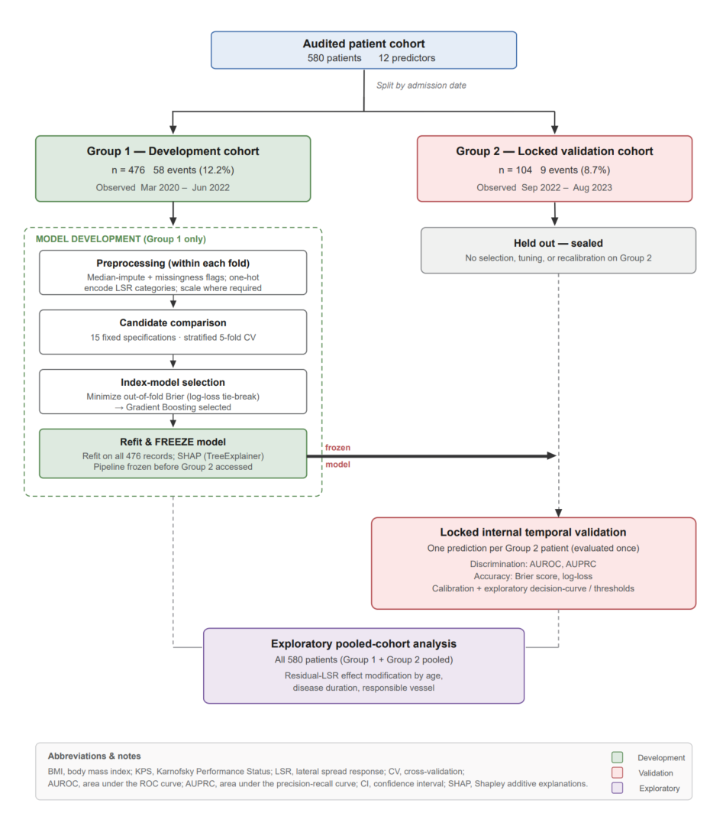
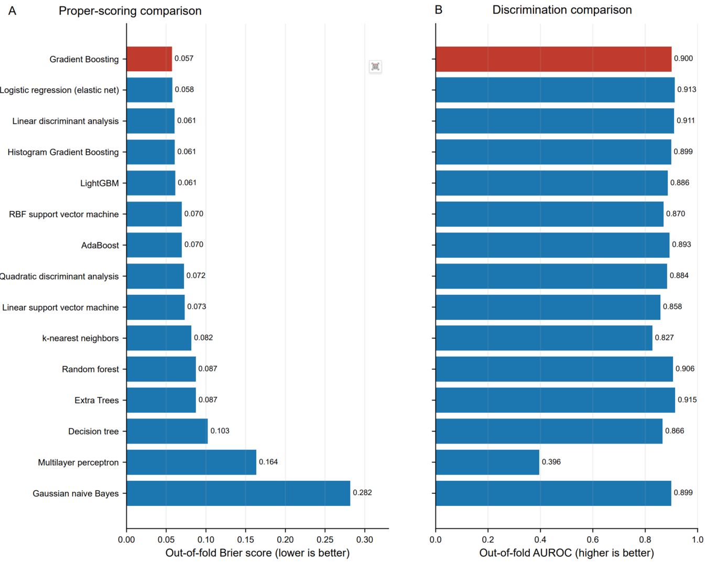
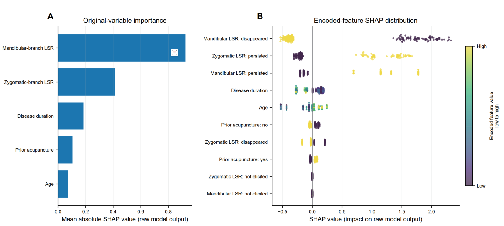
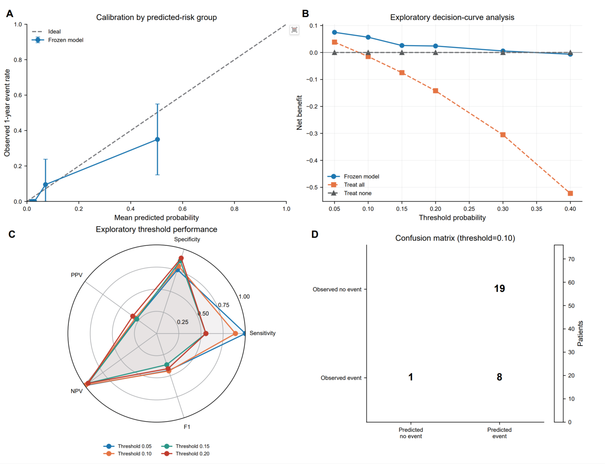
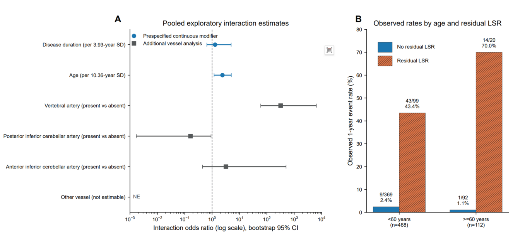
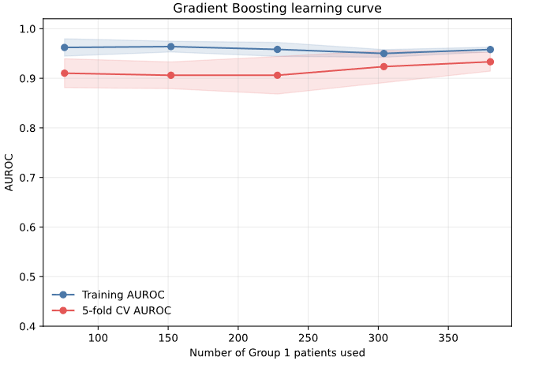
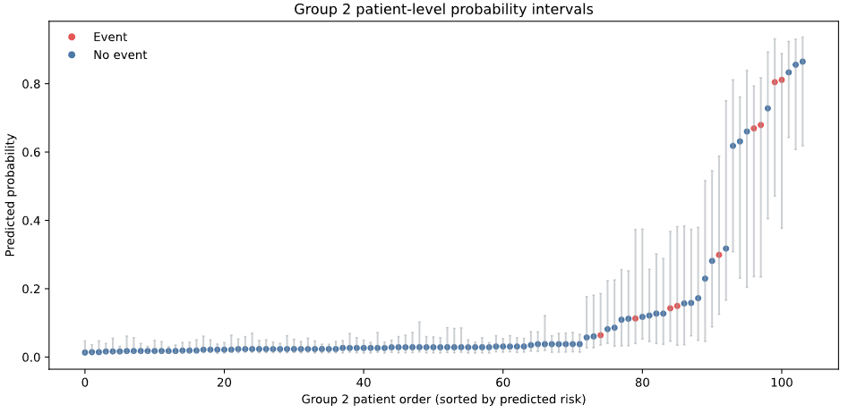
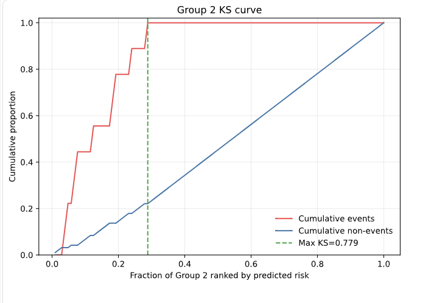

> 修订标记说明：删除线表示建议删除或替换的原文；所有下划线、加粗并斜体的内容为本次建议新增或替换的文字。原始 DOCX 未被修改。
> Data and Code Availability 已与本次确认的正式声明一致，因此保留原文、不重复标记。
> 发布前核验：只有在 Streamlit 页面已确认显示“年龄”且不再显示“肉毒素注射史”，并允许匿名公开访问后，才能保留“publicly accessible”这一表述。

# Machine Learning Prediction of One-Year Spasm After Microvascular Decompression for Hemifacial Spasm Using Two-Branch Intraoperative Lateral Spread Response Monitoring

Jun Yanga,1, Jiawei Shia,1, Jiajia Liua,b, Ke Lia, Yingzhun Lianga, Hanjie Liub, Xing Fana,b,*, Hui Qiaoa,b,*

aBeijing Neurosurgical Institute, Capital Medical University, Beijing, 100070, China.

bBeijing Tiantan hospital, Capital Medical University, Beijing, 100070, China.

*Corresponding author at: Beijing Neurosurgical Institute, Capital Medical University, 119 South 4th Ring Road West, Beijing 100070, China

E-mail address: proqiao@sina.com (H. Qiao), xingkongyaoxiang@163.com (X. Fan)

1 Jun Yang and Jiawei Shi contributed equally to this work as first authors.

## Abstract

Background: Microvascular decompression (MVD) is the definitive treatment for primary hemifacial spasm (pHFS), yet a subset of patients experiences persistent or recurrent spasm. Prior studies have established the prognostic relevance of the intraoperative lateral spread response (LSR), but most relied on single-branch monitoring and conventional association analyses, which cannot generate individualized risk estimates.

Objective: To develop and internally validate a machine learning prediction model that integrates two-branch (zygomatic and mandibular) LSR monitoring with routine clinical variables for predicting one-year postoperative spasm after MVD in patients with pHFS.

Methods: This single-center retrospective cohort study analyzed 580 patients who underwent MVD for pHFS at Beijing Tiantan Hospital. The cohort was split temporally: Group 1 (n = 476) for model development and Group 2 (n = 104) for locked internal temporal validation. 12 predictors—including zygomatic-branch LSR, mandibular-branch LSR, age, disease duration, body mass index, Karnofsky Performance Status score, sex, affected side, hypertension, diabetes mellitus, prior botulinum toxin treatment, and prior acupuncture—were entered into 15 candidate machine learning algorithms.

Results: Gradient Boosting was selected as the index model. Shapley additive explanations analysis identified mandibular-branch LSR, zygomatic-branch LSR, disease duration, prior acupuncture, and age as the five most influential predictors. In the locked temporal validation cohort, the frozen model achieved an area under the receiver operating characteristic curve (AUROC) of 0.899 (95% CI, 0.829–0.957), an area under the precision-recall curve (AUPRC) of 0.361 (95% CI, 0.189–0.700). Exploratory effect-modification analysis suggested that the association between residual LSR and one-year spasm may be amplified in older patients (interaction odds ratio, 2.392; 95% CI, 1.180–5.021). ~~A publicly accessible web-based research calculator was developed from a reduced five-variable model.~~ <u><strong><em>A publicly accessible web-based research calculator was developed using the five highest-ranked original-variable SHAP predictors (MAN-LSR, ZYG-LSR, disease duration, prior acupuncture, and age) and the same fixed Gradient Boosting specification as the index model.</em></strong></u>

Conclusion: A machine learning model integrating two-branch LSR with clinical predictors demonstrated good discrimination for predicting one-year spasm after MVD in a temporally separated internal validation cohort.

## Introduction

Hemifacial spasm (HFS) is a chronic neuromuscular disorder characterized by involuntary, unilateral contractions of the facial muscles that impair daily function and quality of life(1). Primary HFS (pHFS), the predominant form, results from neurovascular compression at the root exit zone of the facial nerve, producing ephaptic transmission and facial-nucleus hyperexcitability(2). Microvascular decompression (MVD) is the definitive treatment, with recent systematic reviews and prospective multicenter studies reporting durable spasm relief in over 90% of patients(3-5). However, a subset of patients still experiences persistent or recurrent spasm(6), and reliable prognostic assessment remains an unmet clinical need.

The lateral spread response (LSR), an abnormal muscle response elicited by stimulating one facial nerve branch and recorded from muscles innervated by another, is the principal intraoperative indicator of decompression adequacy(7). However, its prognostic value has been debated: a definitive meta-analysis of 7,479 patients demonstrated that final intraoperative LSR is highly specific but only moderately sensitive for spasm-free status(8), and subsequent cohort studies have reached conflicting conclusions(9, 10). Moreover, most prior studies have relied on single-branch monitoring, single-timepoint assessment, and conventional association analysis, while delayed relief further complicates single-indicator interpretation(11, 12).

In our previous studies, we demonstrated that two-branch (zygomatic and mandibular) LSR monitoring better stratifies long-term outcome than single-branch monitoring(13), and that combining LSR with the blink reflex improves prognostic accuracy across postoperative time points(14). These findings confirmed that individual intraoperative indicators carry prognostic information, but they relied on conventional association analyses and could not translate multiple predictors into an individualized, validated risk estimate. Meanwhile, emerging prediction-modeling studies in HFS have begun to employ multivariable frameworks(15, 16), yet none has integrated two-branch LSR with clinical predictors in a machine learning pipeline subjected to locked temporal validation and calibration assessment.

Building on this foundation, the present study advances from association testing to prediction modeling. We integrated two-branch LSR monitoring with routine clinical variables, compared 15 candidate machine learning algorithms, and froze the selected index model before evaluating it on a temporally separated internal validation cohort, following the TRIPOD+AI framework with calibration assessment(17). This approach aims to provide an individualized, rigorously validated prognostic tool for predicting one-year outcome after MVD and to support better postoperative expectation management in patients with pHFS.
<u><strong><em>A completed TRIPOD+AI checklist is provided as Supplementary Table S1.</em></strong></u>

## Methods

### Study Design and Participants

This single-center retrospective cohort study with internal temporal validation analyzed data from patients who underwent microvascular decompression (MVD) for primary hemifacial spasm (pHFS) at the Department of Neurosurgery, Beijing Tiantan Hospital, Capital Medical University. The inclusion criteria were as follows: (1) a final diagnosis of pHFS; (2) presence of the lateral spread response (LSR) confirmed by preoperative facial electromyography. The exclusion criteria were: (1) incomplete demographic or clinical data; (2) failure to elicit both zygomatic- and mandibular-branch LSR intraoperatively; (3) insufficient follow-up data (less than one year). The study protocol was reviewed and approved by the Ethics Committee of Beijing Tiantan Hospital. Written informed consent was obtained from all patients or their legal representatives.

### Outcome and Predictors

The primary outcome was the presence or absence of hemifacial spasm at one year after surgery. Follow-up data were obtained through outpatient visits and telephone interviews, with a minimum required follow-up period of one year. The prediction model used 12 source predictors. Four were numerical: age, disease duration, body mass index (BMI), and admission Karnofsky Performance Status (KPS) score. Eight were categorical: sex, affected side, hypertension, diabetes mellitus, prior botulinum toxin treatment, prior acupuncture, zygomatic-branch lateral spread response (ZYG-LSR), and mandibular-branch lateral spread response (MAN-LSR). Each branch-specific LSR variable had three nominal categories: elicited and disappeared, not elicited, and elicited but persisted. The two LSR variables were independently one-hot encoded.

### Temporal Split and Data Quality

Records dated on or before 30 June 2022 formed Group 1, the development cohort (observed range: March 2020 to June 2022). Records after August 2022 formed Group 2, the locked internal temporal validation cohort (observed range: 26 September 2022 to 7 August 2023). A prespecified washout period from 1 July through 31 August 2022 contained no patients.

### Model Development and Freezing

Fifteen fixed candidate specifications were evaluated: elastic-net logistic regression, linear and quadratic discriminant analysis, Gaussian naive Bayes, k-nearest neighbors, linear and radial-basis-function support vector machines, Decision Tree, Random Forest, Extra Trees, AdaBoost, Gradient Boosting, Histogram Gradient Boosting, LightGBM and a multilayer perceptron. Numerical variables were median-imputed with missingness indicators and standardized only for candidates configured with scaling; the Gradient Boosting numerical pipeline was not standardized.

Stratified five-fold cross-validation generated out-of-fold predictions for every fixed specification. Within each outer training fold, the implementation used a three-fold GridSearchCV wrapper with an empty parameter grid, which therefore refitted the same fixed specification without performing substantive hyperparameter optimization. Candidate selection minimized the out-of-fold Brier score, with log-loss as the tie-breaker; area under the receiver operating characteristic curve (AUROC) and area under the precision-recall curve (AUPRC) were secondary metrics.

### Internal Temporal Validation and Statistical Analysis

The frozen pipeline generated one predicted probability for each Group 2 patient. No Group 2 data were used for model selection, feature selection, parameter tuning, or recalibration. Discrimination was summarized by AUROC and AUPRC. Overall predictive accuracy was assessed with the Brier score and log-loss. Calibration was summarized by the calibration intercept and slope from a logistic recalibration model and by grouped observed-versus-predicted event rates. Percentile 95% confidence intervals (CIs) were estimated from 2,000 patient-level bootstrap resamples of Group 2. Decision-curve analysis was performed to compare model net benefit against treat-all and treat-none reference strategies across a prespecified range of probability thresholds. Shapley additive explanations (SHAP) values were calculated with TreeExplainer for the frozen Gradient Boosting model refitted on all Group 1 patients.

~~To support web-based dissemination, a separate reduced model restricted to disease duration, prior botulinum toxin treatment, prior acupuncture, zygomatic-branch LSR, and mandibular-branch LSR was developed using the same Group 1 development and locked Group 2 temporal-validation design; the frozen histogram-based gradient boosting pipeline was implemented as a web-based research calculator that returns the predicted probability of spasm at 1 year after MVD (https://hfs-mvd-risk-calculator.streamlit.app/).~~
<u><strong><em>To support web-based dissemination, the fixed Gradient Boosting specification used by the index model was refitted in Group 1 using the five highest-ranked original-variable SHAP predictors (MAN-LSR, ZYG-LSR, disease duration, prior acupuncture, and age), without re-comparing candidate algorithms. The frozen reduced pipeline was implemented as a publicly accessible web-based research calculator that accepts these five inputs and returns the predicted probability of spasm at 1 year after MVD (https://hfs-mvd-risk-calculator.streamlit.app/). Group 2 was evaluated only after the corrected model was frozen; however, because Group 2 had previously been used to evaluate the superseded prototype, this analysis represents internal temporal validation but not a first-use untouched validation exercise.</em></strong></u>

### Exploratory Effect-Modification Analysis

A separate pooled-cohort analysis examined whether the association between residual LSR and the 1-year outcome varied with age, disease duration, or responsible vessel. Residual LSR was defined as persistence in either the zygomatic- or mandibular-branch response. All analyses were performed using Python 3.12 with pandas, NumPy, SciPy, scikit-learn, matplotlib, and SHAP.

## Results

### Cohort Flow and Characteristics

The study cohort comprised 476 Group 1 patients and 104 Group 2 patients (Figure 1). The 1-year postoperative spasm rate was 12.2% (58/476) in Group 1 and 8.7% (9/104) in Group 2. Mean age was 50.92 (standard deviation [SD] 10.35) years in Group 1 and 52.29 (SD 10.42) years in Group 2 (P = 0.173). Median disease duration was 3.00 (interquartile range [IQR] 2.00–6.00) years in Group 1 and 4.00 (IQR 2.00–6.00) years in Group 2 (P = 0.473). There were no statistically significant differences between the two groups in most demographic and clinical characteristics, except for surgical incision type (P < 0.001) and the proportion of other vessel involvement (P < 0.001). The complete cohort comparison is reported in Table 1.

### Candidate-Model Comparison and Index-Model Selection

Among the 15 primary candidate specifications evaluated in Group 1, Gradient Boosting had the lowest out-of-fold Brier score (0.0573), followed by elastic-net logistic regression (0.0578) (Figure 2). Their log-loss values were 0.2052 and 0.2060, respectively. Elastic-net logistic regression achieved higher AUROC (0.913 vs. 0.900) and AUPRC (0.712 vs. 0.653). Gradient Boosting was retained as the index model under the predefined primary selection rule (lowest Brier score, with log-loss as tie-breaker). These results do not establish broad performance superiority of Gradient Boosting over elastic-net logistic regression. The learning curve analysis demonstrated that the training-to-validation gap progressively narrowed with increasing sample size and that cross-validated AUROC had stabilized by the full Group 1 sample, indicating adequate sample utilization (Figure S1).

### Model Interpretation and Locked Internal Temporal Validation

The five original variables with the largest mean absolute SHAP values in Group 1 were MAN-LSR, ZYG-LSR, disease duration, prior acupuncture, and age (Figure 3). The two branch-specific LSR variables accounted for the largest average changes in the model's raw output.

In Group 2 (n = 104; 9 events), the frozen Gradient Boosting model yielded an AUROC of 0.899 (95% CI, 0.829–0.957), an AUPRC of 0.361 (95% CI, 0.189–0.700), a Brier score of 0.080 (95% CI, 0.043–0.121), and a log-loss of 0.247 (95% CI, 0.147–0.360) (Table 2). The 95% confidence intervals for the calibration intercept and calibration slope were wide and included the ideal values of 0 and 1, respectively.

Grouped calibration showed no observed events in the three lowest predicted-risk groups; the highest-risk group had a mean predicted probability of 0.503 and an observed event rate of 0.350 (Figure 4A). Patient-level predicted probabilities with bootstrap intervals demonstrated that most event patients were concentrated in the upper tail of the risk distribution, while the majority of non-event patients received low predicted probabilities (Figure S2). The Kolmogorov-Smirnov (KS) curve further confirmed the model's discriminatory capacity, with a maximum KS statistic of 0.779 (Figure S3).

In exploratory decision-curve analysis, model net benefit exceeded both treat-all and treat-none reference strategies at thresholds from 0.05 through 0.30, but fell below treat-none at 0.40 (Figure 4B). Threshold-specific sensitivity, specificity, positive predictive value, negative predictive value, and F1 score are summarized descriptively in Figure 4C. At threshold 0.10, the confusion matrix contained 76 true negatives, 19 false positives, 1 false negative, and 8 true positives (Figure 4D). This threshold was selected for illustrative purposes because sensitivity dropped sharply between 0.10 and 0.15, representing a clinically unacceptable loss for a screening application. These estimates are uncertain because Group 2 contained only nine events, and they do not establish a clinically actionable threshold.

### Exploratory Pooled-Cohort Effect Modification

In the pooled 580-patient analysis, the interaction OR for age was 2.392 per 10.36-year increase (bootstrap 95% CI, 1.180–5.021), suggesting that the association between residual LSR and 1-year spasm may strengthen with increasing age (Figure 5A). The corresponding estimate for disease duration was 1.286 per 3.93-year increase (bootstrap 95% CI, 0.645–4.955). Vessel interaction estimates were highly unstable, and the other-vessel interaction was not estimable.

Among patients younger than 60 years, the observed event rate was 2.4% (9/369) without residual LSR and 43.4% (43/99) with residual LSR. Among patients aged 60 years or older, the corresponding rates were 1.1% (1/92) and 70.0% (14/20), respectively (Figure 5B).

## Discussion

The present study advances from association-level evidence to individualized prediction modeling for one-year outcomes after MVD in patients with pHFS. By integrating two-branch LSR with routine clinical variables and comparing 15 candidate machine learning algorithms under a locked temporal validation design, we obtained a frozen Gradient Boosting model that achieved an AUROC of 0.899 (95% CI, 0.829–0.957) in the held-out validation cohort. This result confirms that intraoperative electrophysiological data, when embedded in a multivariable framework, can yield a rigorously validated prognostic tool—moving beyond the conventional association analyses that have characterized prior work in this field, including our own(13, 14).

The dominance of the two branch-specific LSR variables in the SHAP analysis is consistent with a substantial body of evidence supporting the prognostic relevance of intraoperative LSR status. In a definitive meta-analysis pooling 7,479 patients, Thirumala et al. demonstrated that final intraoperative LSR disappearance is highly specific for long-term spasm-free outcomes(8). Prospective single-center studies have reinforced this finding: El Damaty et al. reported that persistent LSR at the end of MVD was the strongest predictor of unfavorable outcome in a 100-patient cohort(18), and Kim et al. observed that the disappearance of LSR during surgery prospectively predicted spasm-free status in their series(19). Al Menabbawy et al. further demonstrated that the timing of LSR disappearance provides additional prognostic information, with early disappearance associated with more favorable outcomes(20). Cho et al. have argued that LSR disappearance serves as the definitive electrophysiological marker of adequate decompression(21), while Cheng et al. showed that combining LSR with brainstem auditory evoked potentials can enhance the monitoring strategy during MVD(22). Conversely, Baranwal et al. cautioned that the clinical utility of LSR disappearance may be overestimated when analyzed in isolation, given the confounding effects of anesthetic depth, stimulation parameters, and the phenomenon of delayed relief(23). Our prediction model addresses this concern by embedding LSR status within a multivariable framework, thereby capturing its prognostic value while accounting for the influence of other clinical factors that may modulate the LSR–outcome relationship.

Beyond the LSR variables, disease duration emerged as the third most influential predictor. This finding is clinically plausible, as prolonged neurovascular compression has been hypothesized to cause progressive demyelination of the facial nerve and hyperexcitability of the facial motor nucleus, potentially making full recovery more difficult even after successful decompression(24-26). Inoue et al. have catalogued diverse reasons for failure and recurrence after MVD—including inadequate decompression, Teflon granuloma, and new vascular compression—and noted that longer disease duration may reflect a more advanced stage of neural pathology that is not fully reversible by surgical decompression alone(27). Prior acupuncture, the fourth-ranked predictor, may serve as a surrogate marker for disease chronicity or health-seeking behavior rather than exerting a direct pathophysiological effect. Age ranked fifth in overall SHAP importance but revealed a more striking pattern in the exploratory effect-modification analysis. The interaction odds ratio for age was 2.392 per standard deviation increase (bootstrap 95% CI, 1.180–5.021), indicating that the association between residual LSR and one-year spasm may be amplified in older patients. This finding resonates with the age-stratified analyses reported by Zhao et al., who compared MVD outcomes between patients older and younger than 70 years and observed comparable overall efficacy but subtle differences in the pattern of recovery(28). Tugend et al. similarly investigated elderly patients undergoing MVD and found that age alone was not a statistically significant predictor of spasm-freedom, suggesting that its effect may be non-linear and primarily manifested through interaction with other factors such as residual LSR(29). Our Gradient Boosting model, with its capacity to capture non-linear relationships and interactions, is well suited to leverage such patterns, which may be difficult to detect using conventional regression approaches.

Decision-curve analysis demonstrated that the model’s net benefit exceeded both the treat-all and treat-none reference strategies at probability thresholds from 0.05 to 0.30(30). This range corresponds to clinical scenarios in which the cost of a false positive (e.g., additional intraoperative manipulation in a patient who would have recovered regardless) is between roughly one-nineteenth and three-sevenths the cost of a false negative (i.e., failing to identify a patient at risk of persistent spasm). While the precise threshold at which clinical action would be warranted remains undefined and requires prospective clinical input, the broad range of superiority suggests that the model could meaningfully inform postoperative counseling and follow-up scheduling. For instance, patients stratified into the highest predicted-risk group could be counseled about the possibility of delayed or incomplete relief and scheduled for closer follow-up, while those in the lowest risk groups could be reassured about their favorable prognosis. However, we emphasize that no clinically actionable threshold was established in this study, and the decision-curve findings are exploratory.

~~Beyond model development and validation, we translated the internally validated five-variable model into a publicly accessible, interactive web-based prediction tool that allows clinicians and researchers to input individual patient data and obtain a real-time estimate of 1-year postoperative spasm probability. To our knowledge, this represents the first open-access online calculator for individualized prognostic prediction in patients with pHFS undergoing MVD. Most existing prediction studies in HFS have reported their models exclusively as static nomograms or regression equations(15, 31, 32), which require manual computation and are less readily integrated into clinical workflow. By contrast, the interactive format of the current tool lowers the barrier to exploratory clinical use and facilitates independent external validation by other centers. We emphasize, however, that in the absence of external validation and a clinically established decision threshold, the calculator should be regarded as a research tool intended to support clinical counseling and hypothesis generation rather than to guide treatment decisions in isolation.~~
<u><strong><em>Beyond model development and validation, we implemented the frozen five-predictor Gradient Boosting model using MAN-LSR, ZYG-LSR, disease duration, prior acupuncture, and age as a publicly accessible web-based research calculator. The calculator allows clinicians and researchers to enter these five values and obtain an individualized estimate of 1-year postoperative spasm probability. Because the model has not undergone external validation and no clinically actionable decision threshold has been established, the calculator should be used for research and clinical counseling support only, not as an independent basis for treatment decisions.</em></strong></u>

Several limitations of this study should be acknowledged. First, this is a single-center retrospective study, and although the temporal validation design provides more rigorous evaluation than random splitting, the generalizability of our model to other institutions with different surgical techniques, monitoring protocols, and patient populations remains unconfirmed. Second, the validation cohort contained only 104 patients with 9 events, resulting in wide confidence intervals for all performance metrics. This sample size, while meeting the minimum threshold for AUROC estimation(33), is insufficient for precise calibration assessment. Third, the outcome was defined as the presence of any spasm at one year, without grading spasm severity or distinguishing between residual and recurrent disease. A more granular outcome scale might capture clinically meaningful differences that a binary classification cannot. Looking forward, several avenues merit investigation. External multicenter validation should be prioritized to assess the model’s transportability and to obtain more precise calibration estimates. Incorporation of the blink reflex, Z-L reflex and other monitoring modalities into an expanded predictor set may further enhance prediction(22). Time-to-event analysis with regular follow-up intervals could reveal the trajectory of symptom resolution and allow dynamic prediction of recovery timing. Finally, the observed age–LSR interaction, if confirmed in larger populations, may have implications for personalized surgical decision-making in elderly patients, for whom the risk–benefit calculus of MVD is particularly relevant(28, 29).

## Conclusion

This study demonstrates that a machine learning model integrating two-branch intraoperative LSR monitoring with routine clinical variables can generate individualized predictions of one-year postoperative spasm in patients with pHFS undergoing MVD. Exploratory analysis suggests that the prognostic impact of residual LSR may be amplified in older patients.

## Declarations

### Ethics approval and consent to participate

The current study was approved by the Ethics Committee of Beijing Tiantan Hospital (KY2026-259-02). Informed consent was obtained from all individual participants included in the study.

### Consent for publication

Not applicable.

### Clinical trial number

Not applicable.

### Competing interests

The authors declare no competing interests.

### Funding

This research received no specific grant from any funding agency in the public, commercial, or not-for-profit sectors.

### Acknowledgements

Not applicable.

### Data and Code Availability

Participant-level data are not publicly available because of patient privacy and institutional ethics requirements. The analysis code, frozen five-variable model artifact, and locked internal temporal-validation report are publicly available at https://github.com/yangjun1997/machine-learning-lsr. The web-based research calculator is publicly accessible at https://hfs-mvd-risk-calculator.streamlit.app/.

## Figure Legends

Figure 1. Study design and analysis workflow.

Figure 2. Group 1 performance of candidate models. (A) Out-of-fold Brier scores for 15 displayed models. (B) Out-of-fold AUROCs for the same 15 models. Predictions for the primary candidates were produced by stratified five-fold cross-validation in Group 1 (n = 476; 58 events). Red identifies the frozen Gradient Boosting index model, teal identifies elastic-net logistic regression. AUROC, area under the receiver operating characteristic curve; AUPRC, area under the precision-recall curve.

Figure 3. SHAP interpretation of the frozen Gradient Boosting model in Group 1. (A) The five original variables with the largest mean absolute SHAP values after contributions from one-hot levels were aggregated to their source variable. (B) Distribution of encoded-feature SHAP values; color represents the encoded feature value. SHAP values are on the raw Gradient Boosting output scale. LSR, lateral spread response; SHAP, Shapley additive explanations.

Figure 4. Internal temporal validation and exploratory threshold performance in Group 2. (A) Observed 1-year event rates plotted against mean frozen-model predictions in five quantile-based risk groups; error bars are percentile 95% confidence intervals from 2,000 within-group bootstrap resamples. (B) Exploratory net benefit for the frozen model, treat-all, and treat-none strategies at thresholds from 0.05 to 0.40. (C) Radar plot of sensitivity, specificity, PPV, NPV, and F1 score at thresholds 0.05, 0.10, 0.15, and 0.20. (D) Confusion matrix at threshold 0.10, selected because sensitivity drops sharply between 0.10 and 0.15. NPV, negative predictive value; PPV, positive predictive value.

Figure 5. Exploratory residual-LSR effect modification in the pooled cohort. (A) Interaction odds ratios from separate weakly ridge-stabilized logistic models fitted to all 580 patients; each model contained residual LSR, one modifier, and their product term; points are interaction odds ratios and bars are percentile 95% confidence intervals from 500 bootstrap resamples; the dashed line denotes an interaction odds ratio of 1. (B) Unadjusted observed event rates by age group and residual-LSR status; residual LSR was defined as persistence in either branch-specific LSR. CI, confidence interval; LSR, lateral spread response; NE, not estimable; OR, odds ratio; SD, standard deviation.

## Supplementary Figure Legends

Figure S1. Learning curve for the frozen Gradient Boosting model in Group 1. Training AUROC (blue) and five-fold cross-validated AUROC (red) are plotted as a function of the number of Group 1 patients used. Shaded bands represent variability across folds. The narrowing gap between training and cross-validated performance and the plateau in cross-validated AUROC indicate that the model had stabilized at the available sample size. AUROC, area under the receiver operating characteristic curve; CV, cross-validation.

Figure S2. Patient-level predicted probabilities with bootstrap intervals in Group 2. Each point represents one Group 2 patient, sorted by predicted risk. Red points indicate patients who experienced 1-year postoperative spasm (events); blue points indicate patients without spasm (non-events). Vertical bars show percentile 95% bootstrap confidence intervals for each patient's predicted probability.

Figure S3. Kolmogorov-Smirnov (KS) curve for the frozen Gradient Boosting model in Group 2. The cumulative proportions of events (red) and non-events (blue) are plotted against the fraction of Group 2 patients ranked by predicted risk (highest risk at right). The maximum KS statistic of 0.779 (green dashed line) indicates the point of greatest separation between the event and non-event distributions, providing an additional measure of the model's discriminatory ability. KS, Kolmogorov-Smirnov.

Table 1. Cohort characteristics by temporal group

| Characteristic | Group 1 development (n=476) | Group 2 internal temporal validation (n=104) | P value |
| --- | --- | --- | --- |
| Age, years | 50.92 (10.35) | 52.29 (10.42) | 0.173a |
| Disease duration, years | 3.00 [2.00, 6.00] | 4.00 [2.00, 6.00] | 0.473a |
| Body mass index, kg/m2 | 25.14 (3.82) | 24.61 (3.18) | 0.165a |
| Admission KPS score | 100.00 [100.00, 100.00] | 100.00 [100.00, 100.00] | 0.447a |
| Intraoperative blood loss, mL | 50.00 [50.00, 50.00] | 50.00 [50.00, 50.00] | 0.794a |
| Female sex | 313 (65.8%) | 68 (65.4%) | 0.942b |
| Left-sided disease | 251 (52.7%) | 50 (48.1%) | 0.389b |
| Hypertension | 172 (36.1%) | 43 (41.3%) | 0.319b |
| Diabetes mellitus | 35 (7.4%) | 7 (6.7%) | 0.824b |
| Type 2 incision | 343 (72.1%) | 49 (47.1%) | <0.001b |
| Prior botulinum toxin treatment | 47 (9.9%) | 12 (11.5%) | 0.611b |
| Prior acupuncture | 154 (32.4%) | 37 (35.6%) | 0.526b |
| Vertebral artery involved | 54 (11.3%) | 10 (9.6%) | 0.610b |
| Posterior inferior cerebellar artery involved | 346 (72.7%) | 75 (72.1%) | 0.905b |
| Anterior inferior cerebellar artery involved | 105 (22.1%) | 17 (16.3%) | 0.195b |
| Other vessel involved | 3 (0.6%) | 9 (8.7%) | <0.001c |
| 1-year postoperative spasm | 58 (12.2%) | 9 (8.7%) | 0.307b |

Note. Values are mean (SD), median [IQR], or n (%). KPS, Karnofsky Performance Status; SD, standard deviation; IQR, interquartile range.

aResults of Mann-Whitney U test; bResults of the Pearson chi-square test; cResults of the Fisher exact test

Table 2. Performance of the frozen Gradient Boosting model in Group 2

| Metric | Estimate | Bootstrap 95% CI |
| --- | --- | --- |
| AUROC | 0.899 | 0.829-0.957 |
| AUPRC | 0.361 | 0.189-0.700 |
| Brier score | 0.080 | 0.043-0.121 |
| Log-loss | 0.247 | 0.147-0.360 |
| Calibration intercept | -0.987 | -2.156-0.237 |
| Calibration slope | 0.698 | 0.424-1.207 |

Note. AUROC, area under the receiver operating characteristic curve; AUPRC, area under the precision-recall curve; CI, confidence interval.

## References

1.	Xiang G, Sui M, Jiang N et al. (2024) The progress in epidemiological, diagnosis and treatment of primary hemifacial spasm. Heliyon. 10: e38600. doi: 10.1016/j.heliyon.2024.e38600

2.	Jesuthasan A, Natalwala A, Davagnanam I, Saifee T, Zrinzo L (2025) Hemifacial spasm: an update on pathophysiology, investigations and management. J Neurol. 272: 502. doi: 10.1007/s00415-025-13220-y

3.	Li J, Lyu L, Chen C, Yin S, Jiang S, Zhou P (2022) The outcome of microvascular decompression for hemifacial spasm: a systematic review and meta-analysis. Neurosurg Rev. 45: 2201-10. doi: 10.1007/s10143-022-01739-x

4.	Holste K, Sahyouni R, Teton Z, Chan AY, Englot DJ, Rolston JD (2020) Spasm Freedom Following Microvascular Decompression for Hemifacial Spasm: Systematic Review and Meta-Analysis. World Neurosurg. 139: e383-e90. doi: 10.1016/j.wneu.2020.04.001

5.	Mizobuchi Y, Nagahiro S, Kondo A et al. (2021) Prospective, Multicenter Clinical Study of Microvascular Decompression for Hemifacial Spasm. Neurosurgery. 88: 846-54. doi: 10.1093/neuros/nyaa549

6.	Menna G, Battistelli M, Rapisarda A, Izzo A, D'Ercole M, Olivi A, Montano N (2022) Factors Related to Hemifacial Spasm Recurrence in Patients Undergoing Microvascular Decompression-A Systematic Review and Meta-Analysis. Brain Sci. 12. doi: 10.3390/brainsci12050583

7.	Miao S, Chen Y, Hu X, Zhou R, Ma Y (2020) An Intraoperative Multibranch Abnormal Muscle Response Monitoring Method During Microvascular Decompression for Hemifacial Spasm. World Neurosurg. 134: 1-5. doi: 10.1016/j.wneu.2019.10.073

8.	Thirumala PD, Altibi AM, Chang R et al. (2020) The Utility of Intraoperative Lateral Spread Recording in Microvascular Decompression for Hemifacial Spasm: A Systematic Review and Meta-Analysis. Neurosurgery. 87: E473-E84. doi: 10.1093/neuros/nyaa069

9.	Helal A, Graffeo CS, Meyer FB, Pollock BE, Link MJ (2024) Predicting long-term outcomes after microvascular decompression for hemifacial spasm according to lateral spread response and immediate postoperative outcomes: a cohort study. J Neurosurg. 140: 1664-71. doi: 10.3171/2023.11.JNS231299

10.	Sprenghers L, Lemmens R, van Loon J (2022) Usefulness of intraoperative monitoring in microvascular decompression for hemifacial spasm: a systematic review and meta-analysis. Br J Neurosurg. 36: 346-57. doi: 10.1080/02688697.2022.2049701

11.	Amano Y, Asayama B, Noro S, Abe T, Okuma M, Honjyo K, Seo Y, Nakamura H (2022) Significant Correlation between Delayed Relief after Microvascular Decompression and Morphology of the Abnormal Muscle Response in Patients with Hemifacial Spasm. Neurol Med Chir (Tokyo). 62: 513-20. doi: 10.2176/jns-nmc.2022-0145

12.	Sato Y, Shimizu K, Iizuka K, Irie R, Matsumoto M, Mizutani T (2022) Factors Related to the Delayed Cure of Hemifacial Spasm after Microvascular Decompression: An Analysis of 175 Consecutive Patients. J Neurol Surg B Skull Base. 83: 548-53. doi: 10.1055/s-0041-1740970

13.	Yang J, Yang X, Liu H et al. (2025) The application value of intraoperative lateral spreading response monitoring during microvascular decompression in patients with primary hemifacial spasm. Eur J Med Res. 30: 1095. doi: 10.1186/s40001-025-03293-w

14.	Yang J, Yang X, Liu J et al. (2026) The clinical utility of intraoperative blink reflex monitoring and its synergistic value with lateral spreading response monitoring in predicting postoperative outcomes in patients with hemifacial spasm following microvascular decompression. Ann Med. 58: 2700159. doi: 10.1080/07853890.2026.2700159

15.	Chen K, Shen L, Yang J et al. (2024) A nomogram based on clinical multivariate factors predicts delayed cure after microvascular decompression for hemifacial spasm. Neurosurg Rev. 47: 44. doi: 10.1007/s10143-024-02284-5

16.	Al Menabbawy A, Refaee EE, Elwy R et al. (2022) A multivariable prediction model for recovery patterns and time course of symptoms improvement in hemifacial spasm following microvascular decompression. Acta Neurochir (Wien). 164: 833-44. doi: 10.1007/s00701-022-05133-w

17.	(2024) TRIPOD+AI statement: updated guidance for reporting clinical prediction models that use regression or machine learning methods. BMJ. 385: q902. doi: 10.1136/bmj.q902

18.	El Damaty A, Rosenstengel C, Matthes M, Baldauf J, Schroeder HW (2016) The value of lateral spread response monitoring in predicting the clinical outcome after microvascular decompression in hemifacial spasm: a prospective study on 100 patients. Neurosurg Rev. 39: 455-66. doi: 10.1007/s10143-016-0708-9

19.	Kim CH, Kong DS, Lee JA, Kwan P (2010) The potential value of the disappearance of the lateral spread response during microvascular decompression for predicting the clinical outcome of hemifacial spasms: a prospective study. Neurosurgery. 67: 1581-7; discussion 7-8. doi: 10.1227/NEU.0b013e3181f74120

20.	Al Menabbawy A, Eisold M, Refaee EE, Lange I, Peters I, Matthes M, Schroeder WS (2025) Timing matters: evaluating lateral spreads response disappearance as a prognostic marker in microvascular decompression for hemifacial spasm: a phenomenological study. Acta Neurochir (Wien). 167: 232. doi: 10.1007/s00701-025-06642-0

21.	Cho KR, Park SK, Park K (2023) Lateral Spread Response: Unveiling the Smoking Gun for Cured Hemifacial Spasm. Life (Basel). 13. doi: 10.3390/life13091825

22.	Cheng D, Liu C, Qiu Y, Ji C (2025) Monitoring of the lateral spread response combined with brainstem auditory evoked potentials in microvascular decompression for hemifacial spasm. Front Neurol. 16: 1516606. doi: 10.3389/fneur.2025.1516606

23.	Baranwal A, Gadhvi MA, Agrawal M, Srivastav S, Dixit A (2025) Lateral Spread Response in Hemifacial Spasm: Physiological Mechanisms, Intraoperative Utility, and Prognostic Significance. Cureus. 17: e82794. doi: 10.7759/cureus.82794

24.	Amano Y, Asayama B, Noro S, Abe T, Okuma M, Honjo K, Seo Y, Nakamura H (2026) Correlation between Delayed Relief after Microvascular Decompression and Morphology of the Lateral Spread Response in Patients with Hemifacial Spasm-Temporal versus Mandibular Branch Stimulation. Neurol Med Chir (Tokyo). 66: 318-9. doi: 10.2176/jns-nmc.2025-0398

25.	Xu L, Xu W, Wang J, Chong Y, Liang W, Jiang C (2020) Persistent abnormal muscle response after microvascular decompression for hemifacial spasm. Sci Rep. 10: 18484. doi: 10.1038/s41598-020-75742-x

26.	Chai S, Wu J, Cai Y et al. (2023) Early lateral spread response loss during microvascular decompression for hemifacial spasm: its preoperative predictive factors and impact on surgical outcomes. Neurosurg Rev. 46: 174. doi: 10.1007/s10143-023-02083-4

27.	Inoue T, Goto Y, Inoue Y, Adidharma P, Prasetya M, Fukushima T (2023) Potential reasons for failure and recurrence in microvascular decompression for hemifacial spasm. Acta Neurochir (Wien). 165: 3845-52. doi: 10.1007/s00701-023-05861-7

28.	Zhao H, Zhu J, Tang YD, Shen L, Li ST (2022) Hemifacial Spasm: Comparison of Results between Patients Older and Younger than 70 Years Operated on with Microvascular Decompression. J Neurol Surg A Cent Eur Neurosurg. 83: 118-21. doi: 10.1055/s-0040-1721018

29.	Tugend M, Ulane CM, Patel K, Sekula RF, Jr. (2024) Decompression Surgery in Elderly Patients with Hemifacial Spasm Refractory to Botulinum Toxin. Mov Disord Clin Pract. 11: 966-72. doi: 10.1002/mdc3.14064

30.	Vickers AJ, van Calster B, Steyerberg EW (2019) A simple, step-by-step guide to interpreting decision curve analysis. Diagn Progn Res. 3: 18. doi: 10.1186/s41512-019-0064-7

31.	Chen Y, Zhao J, Zheng Y, Liu K, Xu Z, Jia F (2026) Preliminary development of a nomogram for predicting recurrence after microvascular decompression in hemifacial spasm: integrating quantitative lateral spread response parameters and clinical features. J Clin Neurosci. 153: 112245. doi: 10.1016/j.jocn.2026.112245

32.	Liu S, Du T, Hou F et al. (2026) Early Risk Stratification and Time-to-Cure Analysis in Patients with Residual Hemifacial Spasm After Microvascular Decompression. Brain Sciences. 16: 978.

33.	Riley RD, Debray TPA, Collins GS, Archer L, Ensor J, van Smeden M, Snell KIE (2021) Minimum sample size for external validation of a clinical prediction model with a binary outcome. Stat Med. 40: 4230-51. doi: 10.1002/sim.9025
